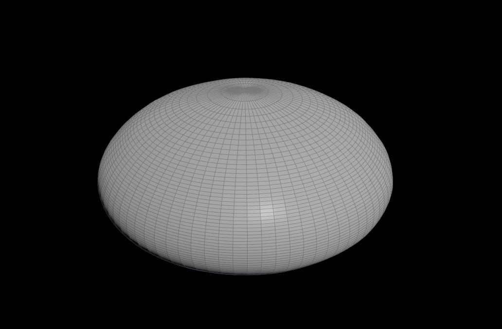
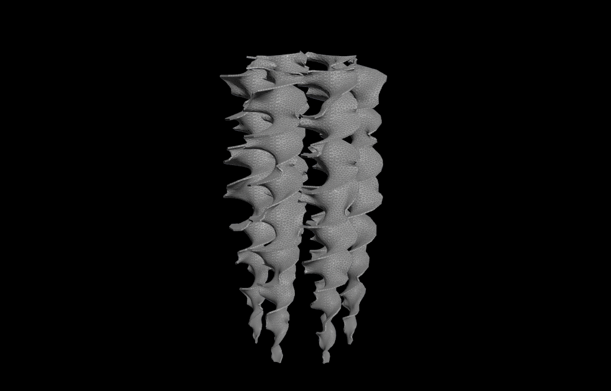
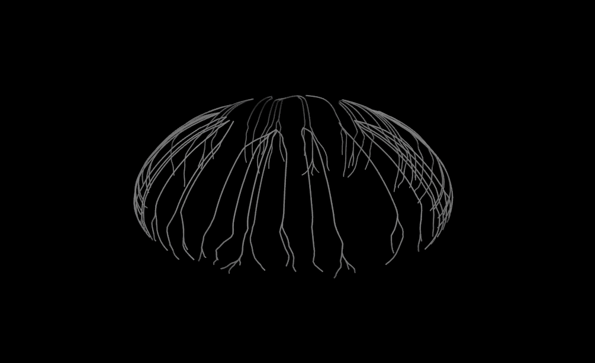
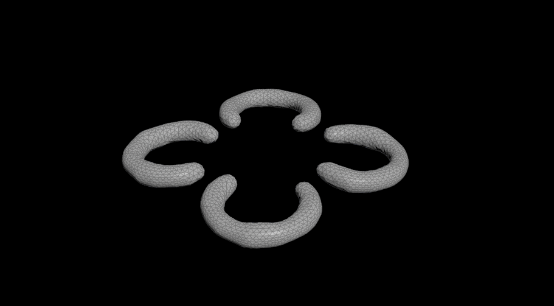
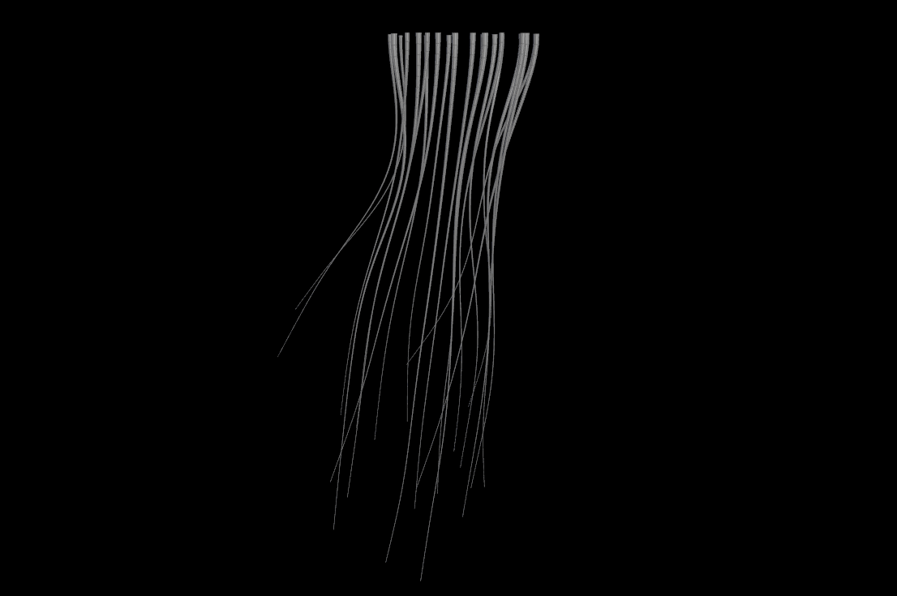

# Procedural Jellyfish
I created a procedural jellyfish in Houdini.

https://github.com/user-attachments/assets/e1f4b596-0827-4b22-91d0-0ef10871f1ba

## Bell

## Arms

## Veins

## Organs

## Tentacles

